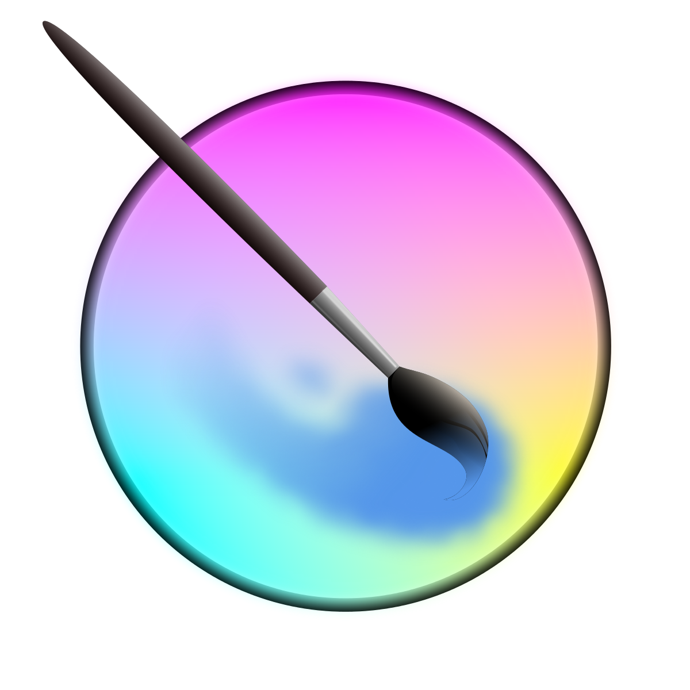

<h1>Welcome, to me github page</h1>

- Hello, I’m Cristian Arcedo
   + Github: @cristian-arc98

- I’m interested in New technologies, imagine, design and create, i'm 3D Generalist && Web dev (front end at the moment)

- Usually i'm intersting to collaborate in projects like:
   + Game development.
   + Humanitary & or solidary projects

   + Web development.

- Contact me:
   + Gmail: cristian.lorca.trabajo@gmail.com
   + Form: https://linktr.ee/Teorik

 

<h2>Software used for work: </h2>
<!-- -->

   

      <h3>3D Generalist:</h3>
         
         
         
         
         
   

   

      <h3>Web dev:</h3>
         
         
         
         
         
   

     
   
  

   

 

  

   

      
      
      
    
      <label><small>For a better & united world</small></label> 
   

   
   

  
   
   

<!---
cristian-arc98/cristian-arc98 is a ✨ special ✨ repository because its `README.md` (this file) appears on your GitHub profile.
You can click the Preview link to take a look at your changes.
--->
