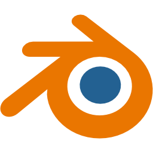

- Hello, I’m Cristian Arcedo
- Github: @cristian-arc98

- I’m interested in New technologies, imagine, design and create, i'm 3D Generalist && Web dev (front end at the moment)

- Usually i'm intersting to collaborate in projects like:
   + Game development.
   + Humanitary & or solidary projects.
   + Web development.

- Contact me:
   + Gmail: cristian.lorca.trabajo@gmail.com
   + Form: https://linktr.ee/Teorik

Software used for work: 
<!-- -->
 
<h3>3D Generalist:</h3>

<h3>Web dev</h3>

<!---
cristian-arc98/cristian-arc98 is a ✨ special ✨ repository because its `README.md` (this file) appears on your GitHub profile.
You can click the Preview link to take a look at your changes.
--->
